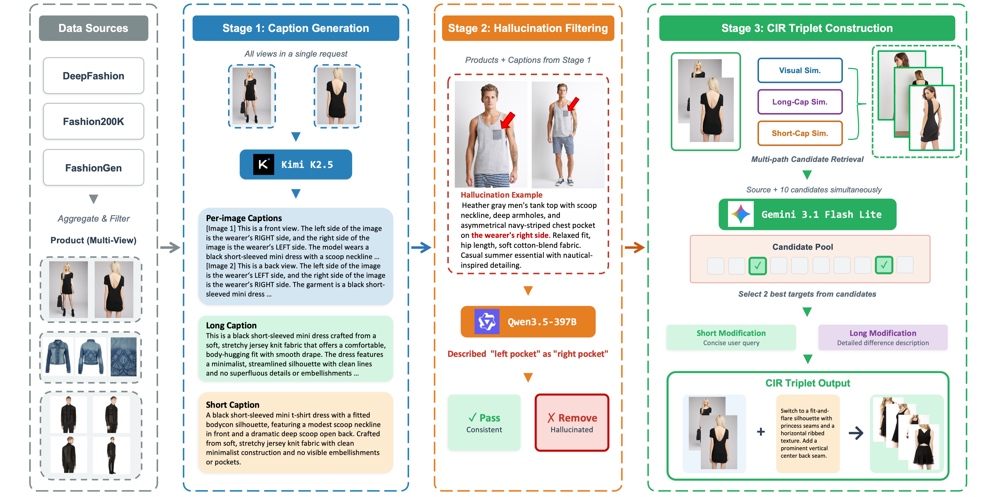
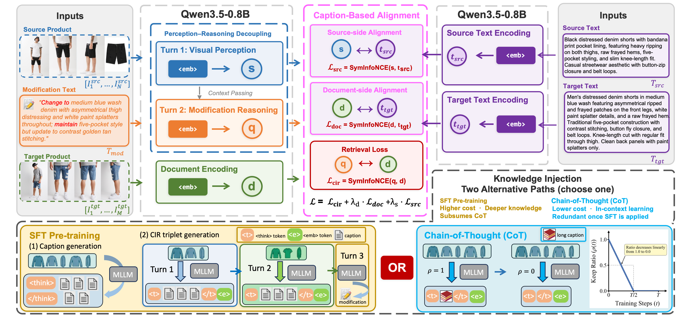

**English** | [中文](README_zh.md)

<h1 align="center">FashionMV: Product-Level Composed Image Retrieval with Multi-View Fashion Data</h1>

<p align="center">
    <a href="https://arxiv.org/abs/2604.10297">
        
    </a>
    <a href="https://github.com/yuandaxia2001/FashionMV">
        
    </a>
    <a href="https://huggingface.co/datasets/yuandaxia/FashionMV">
        
    </a>
    <a href="https://huggingface.co/yuandaxia/ProCIR">
        
    </a>
</p>

## News
```2026-04-14``` 🚀🚀 Release of **ProCIR** code. Release of **ProCIR** (0.8B) model and full **FashionMV** dataset annotations on Hugging Face.

```2026-04-11``` 🎉🎉 Release our paper: [FashionMV: Product-Level Composed Image Retrieval with Multi-View Fashion Data](https://arxiv.org/abs/2604.10297)

## Release Plan

- [x] Paper Release
- [x] FashionMV Dataset (Train/Val Triplets & Captions)
- [x] ProCIR Model Checkpoint
- [x] Data Preparation & Evaluation Code
- [ ] Training Code (Coming Soon)

## Introduction
We identify "View Incompleteness" as a fundamental limitation in existing Composed Image Retrieval (CIR) methods and address it by formally defining the Multi-View CIR task. To support this, we introduce two main contributions:
- **FashionMV**: The first large-scale multi-view fashion dataset specifically designed for product-level CIR, constructed through a fully automated three-stage pipeline.
- **ProCIR**: A modeling framework that transfers a pre-trained MLLM’s generative capabilities to retrieval tasks. It relies on three core mechanisms: a two-stage dialogue architecture, caption-based alignment, and chain-of-thought (CoT) guidance.

Our analysis demonstrates that the two-stage dialogue architecture is an essential prerequisite for effective caption-based alignment, which serves as the single most critical mechanism for injecting product knowledge into the model.


## Data Construction Pipeline

<p align="center">
  
</p>

FashionMV is constructed through a three-stage pipeline:
1. **Caption Generation** — Multi-view product images are fed to a MLLM to generate per-image and product-level captions (long & short).
2. **Hallucination Filtering** — A separate MLLM cross-checks each caption against the images to detect and remove hallucinated descriptions.
3. **CIR Triplet Construction** — Multi-path candidate retrieval (visual, long-caption, short-caption similarity) identifies target products, and a MLLM generates modification texts describing the differences.

## Model Architecture

<p align="center">
  
</p>

**ProCIR** is built on Qwen3.5-0.8B with a perception-reasoning decoupled dialogue architecture:
- **Turn 1 (Perception)**: Encodes multi-view source product images → source embedding `s`
- **Turn 2 (Reasoning)**: Processes modification text with full dialogue context → query embedding `q`

Training combines CIR retrieval loss with caption-based alignment (source-side & document-side) to inject product knowledge. Knowledge injection supports two alternative paths: SFT pre-training or Chain-of-Thought (CoT).

## Quick Start

### 1. Install Dependencies

```bash
pip install -r requirements.txt
```

### 2. Download Dataset and Model

Download the **ProCIR model** from [HuggingFace](https://huggingface.co/yuandaxia/ProCIR) and **FashionMV annotations** from [HuggingFace Datasets](https://huggingface.co/datasets/yuandaxia/FashionMV):

```
FashionMV/
├── model/                          # ProCIR checkpoint (0.8B)
│   ├── config.json
│   ├── model.safetensors
│   ├── tokenizer.json
│   └── ...
└── data/
    ├── val_triplets.jsonl          # 32,718 validation triplets
    ├── val_captions.jsonl          # 18,803 validation captions
    ├── train_triplets.jsonl        # 188,015 training triplets
    └── train_captions.jsonl        # 108,428 training captions
```

### 3. Prepare Image Data

FashionMV uses images from three public datasets. Download them and organize as follows:

```
images/
├── deepfashion/
│   ├── WOMEN/Dresses/id_00004544/02/
│   │   ├── 02_1_front.jpg
│   │   ├── 02_2_side.jpg
│   │   └── ...
│   └── ...
├── f200k/
│   ├── 90456812/
│   │   ├── 90456812_0.jpeg
│   │   ├── 90456812_1.jpeg
│   │   └── ...
│   └── ...
├── fashiongen_val/
│   ├── 95636/
│   │   ├── 974.jpg
│   │   ├── 975.jpg
│   │   └── ...
│   └── ...
└── fashiongen_train/   (only needed for training)
    └── ...
```

#### DeepFashion

1. Download [In-shop Clothes Retrieval Benchmark](http://mmlab.ie.cuhk.edu.hk/projects/DeepFashion/InShopRetrieval.html)
2. Organize images by product ID following the original directory structure

#### Fashion200K

1. Download from [fashion-200k](https://github.com/xthan/fashion-200k)
2. Group images by product ID into folders

#### FashionGen

> **Note**: The official FashionGen website is currently unavailable. Researchers may need to obtain `fashiongen_256_256_validation.h5` (and optionally `fashiongen_256_256_train.h5`) through alternative sources such as [Kaggle](https://www.kaggle.com/) or other academic channels. We do not provide download links for this dataset.

1. The h5 file stores images row by row. Each row has an `input_productID` field (int32) that identifies which product it belongs to. Rows for the same product are stored **consecutively**. The `product_id` in our triplets/captions maps directly to this field.
2. Extract images using our script (no mapping file needed — it reads `input_productID` from the h5 directly):

```bash
# Validation set
python tools/prepare_fashiongen.py \
  --h5_path /path/to/fashiongen_256_256_validation.h5 \
  --output_dir /path/to/images/fashiongen_val

# Training set (optional)
python tools/prepare_fashiongen.py \
  --h5_path /path/to/fashiongen_256_256_train.h5 \
  --output_dir /path/to/images/fashiongen_train
```

### 4. Run Evaluation

Each dataset is evaluated **independently** with its own gallery. You can evaluate all three datasets at once, or select specific ones via `--datasets`.

**Arguments:**

| Argument | Required | Description |
|----------|----------|-------------|
| `--model_path` | Yes | Path to ProCIR model checkpoint |
| `--image_root` | Yes | Root directory containing `deepfashion/`, `f200k/`, `fashiongen_val/` |
| `--data_dir` | Yes | Directory containing `val_triplets.jsonl` |
| `--datasets` | No | Which datasets to evaluate. Choices: `deepfashion`, `f200k`, `fashiongen_val`. Default: all three |
| `--output_dir` | No | Where to save results (default: `./results`) |
| `--batch_size` | No | Batch size (default: 10) |

#### Evaluate on all datasets

```bash
python evaluate.py \
  --model_path /path/to/model \
  --image_root /path/to/images \
  --data_dir /path/to/data
```

#### Evaluate on a single dataset (e.g., DeepFashion only)

```bash
python evaluate.py \
  --model_path /path/to/model \
  --image_root /path/to/images \
  --data_dir /path/to/data \
  --datasets deepfashion
```

#### Evaluate on specific datasets

```bash
python evaluate.py \
  --model_path /path/to/model \
  --image_root /path/to/images \
  --data_dir /path/to/data \
  --datasets deepfashion f200k
```

#### Multi-GPU (DDP)

```bash
torchrun --nproc_per_node=4 evaluate.py \
  --model_path /path/to/model \
  --image_root /path/to/images \
  --data_dir /path/to/data \
  --datasets deepfashion
```

> **Note**: You only need to prepare image data for the datasets you want to evaluate. For example, if you only evaluate on DeepFashion, you don't need to download Fashion200K or FashionGen.

### Expected Results

ProCIR (0.8B):

| Dataset | R@5 | R@10 |
|---------|-----|------|
| DeepFashion | 89.2 | 95.1 |
| Fashion200K | 77.6 | 86.6 |
| FashionGen-val | 75.0 | 85.3 |
| **Average** | **80.6** | **89.0** |

## Project Structure

```
├── evaluate.py                  # Main evaluation entry point
├── requirements.txt
├── README.md                    # English
├── README_zh.md                 # 中文
├── assets/                      # Figures
│   ├── data_pipeline.png        # Data construction pipeline
│   └── model_framework.png      # ProCIR model architecture
├── procir/                      # Core model and data modules
│   ├── __init__.py
│   ├── model.py                 # FashionEmbeddingModel (Qwen3.5 wrapper)
│   ├── chat_utils.py            # Chat template utilities
│   ├── datasets.py              # CIRValDataset, ProductValDataset
│   └── collators.py             # DocCollator, CIRQueryCollator
└── tools/
    └── prepare_fashiongen.py    # FashionGen h5 image extraction
```

## Citation

```bibtex
@article{yuan2026fashionmv,
  title={FashionMV: Product-Level Composed Image Retrieval with Multi-View Fashion Data},
  author={Yuan, Peng and Mei, Bingyin and Zhang, Hui},
  year={2026}
}
```


## License

- **Code:** [MIT License](LICENSE).
- **Model Weights:** Subject to the original Qwen3.5 license.
- **Dataset Annotations:** [CC BY-NC 4.0](https://creativecommons.org/licenses/by-nc/4.0/).
- **Images:** Must be obtained from their original sources and are governed by their respective licenses.
